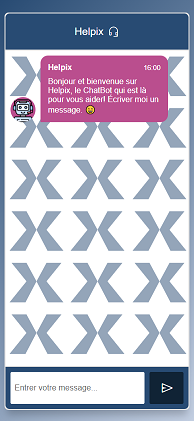
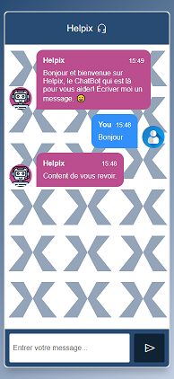
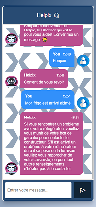
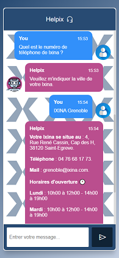

<h1 align="center">Helpix</h1>

## 📸Interface utilisateur
<br>

## 👨‍💻 Prérequis pour le chatbot

Avant de pouvoir exécuter le chatbot, assurez-vous de disposer des éléments suivants :

## 🐍 Python

Assurez-vous d'avoir Python installé sur votre système. Vous pouvez vérifier cela en exécutant la commande suivante dans votre terminal :

```
python --version
```

Si Python n'est pas installé, veuillez vous rendre sur le site officiel de Python (https://www.python.org) pour télécharger et installer la dernière version.

## 📚 Bibliothèques Python

Le chatbot utilise plusieurs bibliothèques Python. Vous pouvez les installer en utilisant la commande `pip install` dans votre terminal. Voici les bibliothèques requises :

```
pip install tensorflow

pip install keras

pip install pickle

pip install nltk

pip install flask
```

Assurez-vous d'exécuter ces commandes une fois que Python est installé sur votre système.

Une fois que vous avez installé Python et les bibliothèques requises, vous êtes prêt à exécuter le chatbot !

